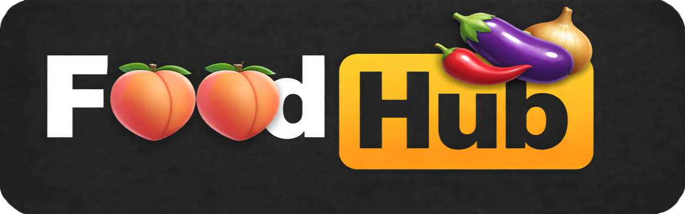

## A Recipe Search Platform For All Your Needs
*Fast, easy, and surprisingly satisfying.\
Craving something good?\
***FoodHub*** turns your leftovers into something worth eating. 
Save money, cut waste, and satisfy your cravings – zero planning required.*

---

## 📋 Project Overview
### FoodHub is a robust data platform and backend API designed to bridge the gap between raw ingredients and delicious meals. It features:
* **Smart Search:** Search for recipes by entering up to 10 ingredients.
* **Fuzzy Matching:** Handles smaller typos and misspellings (e.g., "avocdo" -> "avocado") using RapidFuzz.
* **Ranking Logic:** Recipe suggestions are ranked by the number of matching ingredients.
* **Cache-First Strategy:** Checks the database before calling the Spoonacular API to minimize API costs.
* **Search Statistics:** Tracks and visualizes the most popular ingredient searches using Matplotlib.
* **Frontend:** A lightweight web interface for searching recipes and viewing history and search statistic.

---

## 🏗️ Architecture & Data Flow


The system is built as a modern data engineering pipeline within a **Docker Compose environment**, 
ensuring seamless communication between microservices, streaming components, and cloud storage:

### 1. **User Interaction & Frontend**
The journey begins at the **Frontend (localhost:8000)**. Users can search for recipes by ingredients, 
view their search history, and access data insights through automated **Matplotlib** visualizations.

### 2. **FastAPI: The Orchestrator**
The backend acts as the system's brain, managing the flow of data:
* **Fuzzy Search:** Uses **RapidFuzz** to handle typos, ensuring "chiken" still returns "chicken" recipes.
* **Database Connectivity:** Leverages **psycopg** for high-performance communication with the Supabase instance.
* **Smart Caching:** FastAPI first checks the `curated_recipes` table. On a "cache hit," data is returned instantly to save API tokens. 
On a "miss," it fetches fresh data from the **Spoonacular API**.

### 3. **The Streaming Pipeline (Kafka)**
To ensure asynchronous processing and scalability, we utilize **Apache Kafka**:
* **Producer:** When new data is fetched from Spoonacular, FastAPI acts as a Producer, pushing the results as events into the **Kafka Cluster**.
* **Consumer:** A dedicated **Kafka Consumer** listens to the stream, reads the incoming data, and persists the raw payloads into the staging layer.

### 4. **Storage Layer (Supabase / PostgreSQL)**
Data is persisted into three distinct functional layers within **Supabase** to separate concerns:
* **`staging_recipes` (Raw Data):** Stores untreated JSON payloads from Kafka for historical auditing and backup.
* **`curated_recipes` (Validated Data):** Holds cleaned, structured, and validated recipe data, optimized for frontend performance.
* **`search_log` (Analytics):** Logs user search queries (ingredients) to provide the data source for search frequency statistics.

### 5. **Data Transformation**
Throughout the flow, **Pandas** is used to clean, filter, and validate the data, ensuring that only high-quality, structured information moves from the staging area to the curated layer.

---

## 💻 Tech Stack


---

## 🚀 Getting Started
### Prerequisites
* Python 3.12
* Docker Desktop
* uv – [install here](https://docs.astral.sh/uv/getting-started/installation/)
* A Supabase account and project – [get started here](https://supabase.com)

### Installation
1. Clone the repository
```bash
git clone https://github.com/LisaYllander92/LAB2_Data_platform_FoodHub.git
cd LAB2_Data_platform_FoodHub
```
2. Install dependencies
```bash
uv sync
```
3. Set up your `.env` file with your Supabase credentials:
```env
DB_HOST=your-db-host
DB_PORT=6543
DB_NAME=postgres
DB_USER=postgres
DB_PASSWORD=your-supabase-password
SPOONACULAR_API_KEY=your-api-key
SPOONACULAR_USERNAME=your-spoonacular-username
SPOONACULAR_HASH=your-spoonacular-hash
```
4. Initialize the database schema in Supabase by running `init.sql` in the Supabase SQL editor.
5. Start all services
```bash
docker compose up --build
```
6. Access the app:
- **Frontend:** http://localhost:8000
- **API docs (Swagger):** http://localhost:8000/docs
- **Kafka UI:** http://localhost:8080
- **Search statistics plot:** http://localhost:8000/api/recipes/stats/plot
---
## 📊 API Endpoints
| Method | Endpoint | Description |
|--------|----------|-------------|
| GET | `/api/recipes/search` | Search recipes by ingredients |
| GET | `/api/recipes/detail/{title}` | Get full recipe details |
| GET | `/api/recipes/history` | View recently saved recipes |
| GET | `/api/recipes/popular-searches` | Top 10 most searched ingredients |
| GET | `/api/recipes/stats/plot` | Bar chart of popular searches |
| POST | `/api/recipes` | Send a recipe to Kafka |

---

## 👀 Behind the scenes 
*Detailed documentation of our architectural design and agile development process:*

### 📊 Data Modeling
*Click the links below to view our models:*
- [Conceptual Model](images/Conceptual_model.png)
- [First logical Model](images/Logical_model.png)
- [Final logical model](images/final_logical_model.png)

### 🔄 Agile Process & Logs
**Sprint 1**
- [Activity Log](docs/sprint1_activity_log.md)
- [Retrospective](docs/sprint1_retrospective.md)

**Sprint 2**
- [Activity Log](docs/sprint2_activity_log.md)
- [Retrospective](docs/sprint2_retrospective.md)

**Sprint 3**
- [Activity Log](docs/sprint3_activity_log.md)
- [Retrospective](docs/sprint3_retrospective.md)

**Sprint 4**
- [Activity Log](docs/sprint4_activity_log.md)
- [Retrospective](docs/sprint4_retrospective.md)

**Sources**
- [Sources & AI usage](docs/foodhub_sources.pdf)